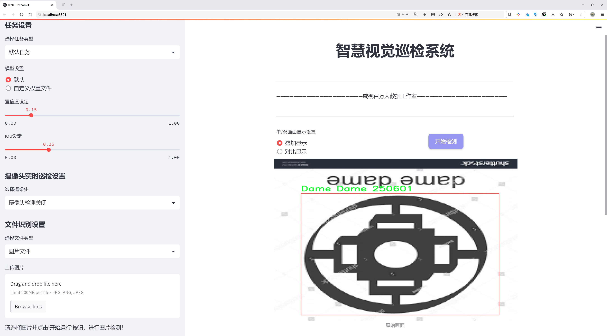
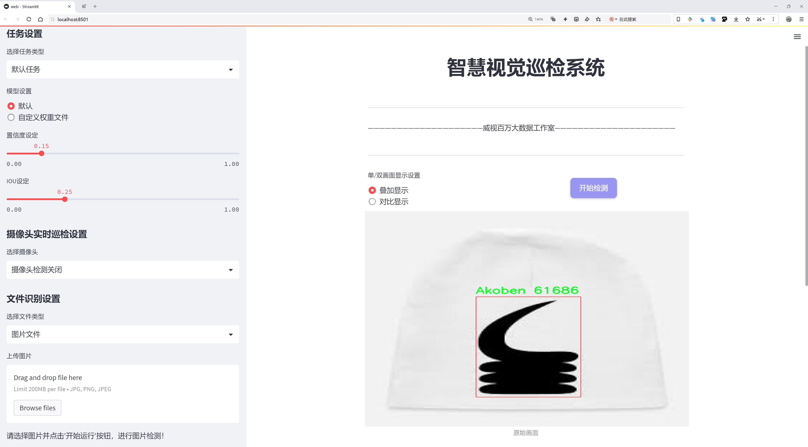
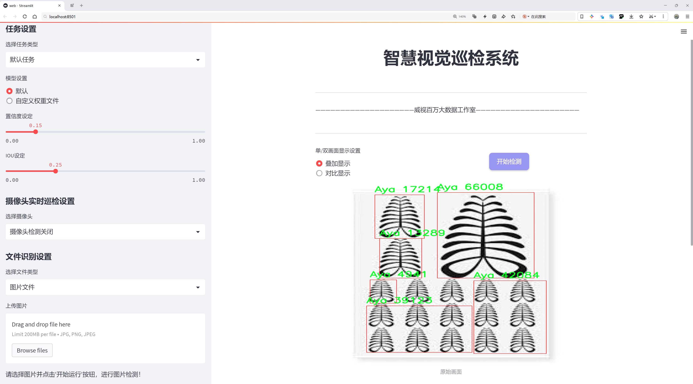
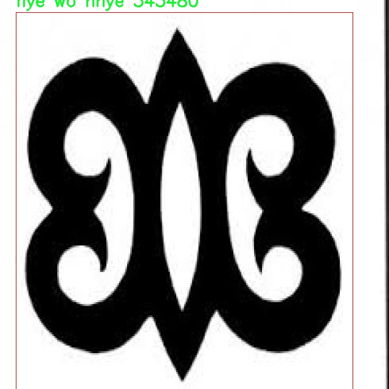
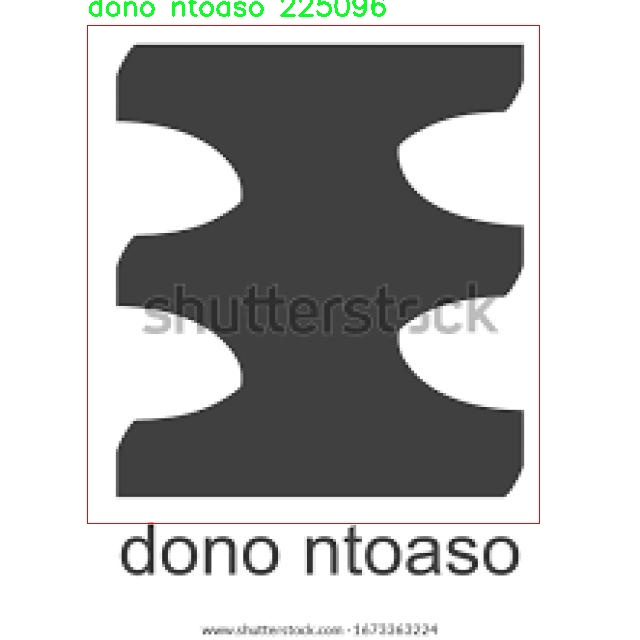
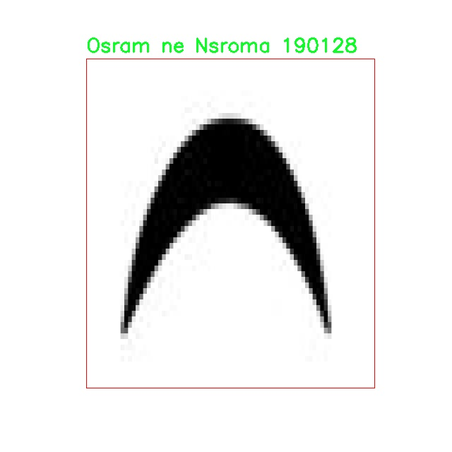

# 阿丁克拉符号识别检测系统源码分享
 # [一条龙教学YOLOV8标注好的数据集一键训练_70+全套改进创新点发刊_Web前端展示]

### 1.研究背景与意义

项目参考[AAAI Association for the Advancement of Artificial Intelligence](https://gitee.com/qunshansj/projects)

项目来源[AACV Association for the Advancement of Computer Vision](https://gitee.com/qunmasj/projects)

研究背景与意义

阿丁克拉符号是源自西非的传统文化符号，承载着丰富的历史、哲学和社会意义。这些符号不仅在艺术和设计中占有重要地位，还在教育、文化传承和社会交流中发挥着不可或缺的作用。随着全球化的推进，阿丁克拉符号逐渐被更多的人所认识和接受，成为跨文化交流的重要媒介。然而，传统的阿丁克拉符号识别方法多依赖于人工识别，效率低下且容易受到主观因素的影响。因此，基于计算机视觉技术的自动化识别系统的开发显得尤为重要。

近年来，深度学习技术的迅猛发展为物体检测领域带来了新的机遇。YOLO（You Only Look Once）系列模型因其高效的实时检测能力而受到广泛关注。YOLOv8作为该系列的最新版本，结合了更为先进的网络结构和训练策略，具备了更强的特征提取和分类能力。然而，现有的YOLOv8模型在特定领域的应用上仍存在一定的局限性，尤其是在处理复杂背景和多样化符号时，识别准确率有待提高。因此，针对阿丁克拉符号的特征，改进YOLOv8模型以提升其识别性能，具有重要的学术价值和实际意义。

本研究旨在基于改进的YOLOv8模型，构建一个高效的阿丁克拉符号识别系统。通过对1700幅包含107类阿丁克拉符号的图像数据集进行深入分析与处理，研究将聚焦于符号的形状、颜色和纹理等特征，探索如何通过改进网络结构和优化训练策略来提高模型的识别准确率。数据集中包含的符号种类丰富，涵盖了如“Aban”、“Adinkrahene”、“Sankofa”等具有深厚文化内涵的符号，这为模型的训练提供了多样化的样本，能够有效提升模型的泛化能力。

此外，阿丁克拉符号的自动识别不仅能够促进相关文化的传播与保护，还能为教育、艺术创作等领域提供新的工具和方法。通过将传统文化与现代科技相结合，本研究将为阿丁克拉符号的数字化和智能化发展提供新的思路。同时，研究成果也有望为其他传统文化符号的识别与应用提供借鉴，推动相关领域的进一步研究与发展。

综上所述，基于改进YOLOv8的阿丁克拉符号识别系统的研究，不仅具有重要的理论意义，还具备广泛的应用前景。通过本研究的开展，将为阿丁克拉符号的自动识别提供一种新的解决方案，助力传统文化的传承与创新，推动文化多样性的保护与发展。

### 2.图片演示







##### 注意：由于此博客编辑较早，上面“2.图片演示”和“3.视频演示”展示的系统图片或者视频可能为老版本，新版本在老版本的基础上升级如下：（实际效果以升级的新版本为准）

  （1）适配了YOLOV8的“目标检测”模型和“实例分割”模型，通过加载相应的权重（.pt）文件即可自适应加载模型。

  （2）支持“图片识别”、“视频识别”、“摄像头实时识别”三种识别模式。

  （3）支持“图片识别”、“视频识别”、“摄像头实时识别”三种识别结果保存导出，解决手动导出（容易卡顿出现爆内存）存在的问题，识别完自动保存结果并导出到tempDir中。

  （4）支持Web前端系统中的标题、背景图等自定义修改，后面提供修改教程。

  另外本项目提供训练的数据集和训练教程,暂不提供权重文件（best.pt）,需要您按照教程进行训练后实现图片演示和Web前端界面演示的效果。

### 3.视频演示

[3.1 视频演示](https://www.bilibili.com/video/BV1C34JeHEwf/)

### 4.数据集信息展示

##### 4.1 本项目数据集详细数据（类别数＆类别名）

nc: 103
names: ['Aban', 'Abe dua', 'Abusua Pa', 'Adinkrahene Dua', 'Adinkrahene', 'Adwera', 'Adwo', 'Agyindawuru', 'Akoben', 'Akofena', 'Akoko_nan', 'Akoma', 'AkomaNtoaso', 'Ananse Ntontan', 'Asaase ye duru', 'Aya', 'Bese_saka', 'Bi Nka Bi', 'Biribiara Beye yie', 'Boa me na memmoa wo', 'Dame Dame', 'Denkyem', 'Dono', 'Duafe', 'Dwinnemmen', 'EPA', 'Enibere_enso_gya', 'Ese_Ne_Tekrema', 'Fafanto', 'Fihankra', 'Fofo', 'Funtumfunefu Denkyemfunefu', 'Gyenyame', 'KaeMe', 'Kojo Baiden', 'Kramo Bone Amma Yeanhu Kramo Pa', 'Kuronti ne Akwamu', 'Kwatakye Atiko', 'Mate masie', 'Mframadan', 'Mmara Krado', 'Mmomudwan', 'Mmusuyidie', 'Mpatapo', 'Mpuannum', 'Nante Yie', 'Nea Ope Se Obedi Hene', 'Nea onnim', 'Nea wope se nkrofo ye ma wo no', 'Nkyinkyim', 'Non-Adinkra', 'Nsoroma', 'Ntesie', 'Nyame Akuma', 'Nyame Biribi wo soro', 'Nyame nti', 'Nyame nwu na mawu', 'Nyame ye Ohene', 'Odo nnyew fie kwan', 'Ohene Aniwa', 'Ohene Tuo', 'Okodee Mmowere', 'Okuafo Pa', 'Onyankopon Aniwa', 'Onyankopon ne yen ntena', 'Osiadan Nyame', 'Osram ne Nsroma', 'Osram', 'Owuo kum Nyame', 'Pempamsie', 'Sankofa', 'Sepow', 'Sesa wo suban', 'Sunsum', 'Tabono', 'Tamfo Bebre', 'Tumi te se Kosua', 'Tuo ne Akofena', 'Wawa Aba', 'Wo Nsa Da Mu a', 'Wonsa_da_mu_a', 'dono ntoaso', 'eban', 'fawohodie', 'hwehwemudua', 'hye wo nhye', 'ketepa', 'kuntinkantan', 'mako', 'nkonsonkonson', 'nkontim', 'nkuruma kesse', 'nkyima', 'nsaa', 'nserewa', 'nyame Dua', 'nyansapo', 'ohene adwa', 'owo foro adobe', 'owuo atwedee', 'pagya', 'sankofa', 'woforo dua pa a']


##### 4.2 本项目数据集信息介绍

数据集信息展示

在本研究中，我们使用了名为“Adinkra symbols”的数据集，旨在训练和改进YOLOv8模型，以实现高效的阿丁克拉符号识别系统。阿丁克拉符号源自于西非的加纳，具有丰富的文化内涵和象征意义，广泛应用于艺术、纺织和装饰等领域。该数据集包含103个不同的类别，每个类别都代表一种独特的阿丁克拉符号，这些符号不仅在视觉上具有辨识度，而且在社会文化中承载着深厚的历史和意义。

数据集中包含的类别涵盖了多种阿丁克拉符号，如“Aban”（围墙）、“Abe dua”（榕树）、“Abusua Pa”（良好的家族）等。这些符号的选择反映了加纳文化的多样性和复杂性。例如，“Sankofa”象征着回顾过去以更好地面对未来，而“Gyenyame”则表达了对上帝的信仰和依赖。每个符号不仅仅是一个图形，它们的背后都有着丰富的故事和教义，传递着道德、智慧和生活哲学。

在数据集的构建过程中，确保了每个符号的高质量图像采集，以便为YOLOv8模型提供清晰、准确的训练样本。这些图像的多样性，包括不同的背景、光照条件和符号的表现形式，增强了模型的泛化能力，使其能够在实际应用中更好地识别和分类阿丁克拉符号。通过这种方式，我们希望模型不仅能够识别出符号的形状，还能理解其文化背景和象征意义，从而在更广泛的场景中应用。

此外，数据集中的每个类别都经过精心标注，确保了训练过程中的准确性和有效性。标注的细致程度直接影响到模型的学习效果，因此我们在标注过程中采用了严格的标准，以确保每个符号的特征都被准确捕捉。通过这种高质量的标注，YOLOv8模型能够在训练过程中学习到符号的细微差别，从而提高识别的准确率。

在未来的研究中，我们计划进一步扩展该数据集，增加更多的阿丁克拉符号以及不同的表现形式，以增强模型的学习能力和适应性。通过不断丰富数据集，我们希望能够推动阿丁克拉符号识别技术的发展，使其在文化遗产保护、教育和艺术创作等领域发挥更大的作用。

总之，“Adinkra symbols”数据集为我们提供了一个强大的基础，以训练和改进YOLOv8模型，实现高效的符号识别。通过对阿丁克拉符号的深入研究和理解，我们不仅希望提升技术水平，更希望能够传播和弘扬这一独特的文化遗产。









### 5.全套项目环境部署视频教程（零基础手把手教学）

[5.1 环境部署教程链接（零基础手把手教学）](https://www.ixigua.com/7404473917358506534?logTag=c807d0cbc21c0ef59de5)


[5.2 安装Python虚拟环境创建和依赖库安装视频教程链接（零基础手把手教学）](https://www.ixigua.com/7404474678003106304?logTag=1f1041108cd1f708b01a)

### 6.手把手YOLOV8训练视频教程（零基础小白有手就能学会）

[6.1 手把手YOLOV8训练视频教程（零基础小白有手就能学会）](https://www.ixigua.com/7404477157818401292?logTag=d31a2dfd1983c9668658)

### 7.70+种全套YOLOV8创新点代码加载调参视频教程（一键加载写好的改进模型的配置文件）

[7.1 70+种全套YOLOV8创新点代码加载调参视频教程（一键加载写好的改进模型的配置文件）](https://www.ixigua.com/7404478314661806627?logTag=29066f8288e3f4eea3a4)

### 8.70+种全套YOLOV8创新点原理讲解（非科班也可以轻松写刊发刊，V10版本正在科研待更新）

由于篇幅限制，每个创新点的具体原理讲解就不一一展开，具体见下列网址中的创新点对应子项目的技术原理博客网址【Blog】：


[8.1 70+种全套YOLOV8创新点原理讲解链接](https://gitee.com/qunmasj/good)

### 9.系统功能展示（检测对象为举例，实际内容以本项目数据集为准）

图9.1.系统支持检测结果表格显示

  图9.2.系统支持置信度和IOU阈值手动调节

  图9.3.系统支持自定义加载权重文件best.pt(需要你通过步骤5中训练获得)

  图9.4.系统支持摄像头实时识别

  图9.5.系统支持图片识别

  图9.6.系统支持视频识别

  图9.7.系统支持识别结果文件自动保存

  图9.8.系统支持Excel导出检测结果数据


### 10.原始YOLOV8算法原理

原始YOLOv8算法原理

YOLOv8算法作为目标检测领域中的一项重要进展，延续了YOLO系列算法的优良传统，同时在多个方面进行了创新和优化。该算法的设计理念主要围绕着提高检测精度和计算效率，尤其是在处理复杂场景和多样化目标时的表现。YOLOv8的核心在于其独特的网络结构和改进的损失函数，这些创新使得它在实时目标检测任务中表现出色。

首先，YOLOv8在骨干网络的设计上采用了跨级结构（Cross Stage Partial, CSP），这一结构的引入旨在提高特征提取的效率和准确性。与YOLOv5相比，YOLOv8对C3模块进行了优化，采用了更轻量的C2f模块。这种结构的调整不仅减少了计算量，还提高了模型的推理速度，使得YOLOv8能够在更低的硬件要求下实现高效的目标检测。此外，YOLOv8依然保留了空间金字塔池化（SPPF）模块，这一模块的使用有效地增强了模型对多尺度目标的检测能力。

在特征融合方面，YOLOv8引入了特征金字塔网络（FPN）和路径聚合网络（PAN），通过多尺度特征的融合，进一步提升了模型对不同尺寸目标的检测性能。与传统的上采样阶段不同，YOLOv8在此阶段中删除了卷积结构，采用了更为简洁的连接方式，从而减少了模型的复杂性，同时保持了高效的特征传递。这种设计使得YOLOv8在处理复杂场景时，能够更好地保留重要的上下文信息，从而提高检测的准确性。

YOLOv8的损失函数设计也是其一大亮点。算法采用了新的损失策略，通过变焦损失（Focal Loss）来计算分类损失，这一策略有效地解决了类别不平衡问题，使得模型在面对难以检测的目标时，依然能够保持较高的识别率。同时，YOLOv8引入了数据平均保真度损失和完美交并比损失（Perfect IoU Loss）来计算边界框损失。这种多维度的损失计算方式，使得模型在训练过程中能够更好地优化边界框的定位精度，从而提高目标检测的整体性能。

此外，YOLOv8在样本匹配方式上也进行了创新，采用了Anchor-Free的检测方式，减少了对预定义锚框的依赖。这一变化使得模型在处理多样化目标时，能够更加灵活地适应不同的目标形状和尺寸，进一步提升了检测的准确性和鲁棒性。解耦头结构的引入，使得模型在进行目标分类和边界框回归时，可以独立优化，从而提高了整体的检测性能。

值得一提的是，YOLOv8的不同版本（如YOLOv8n、YOLOv8s、YOLOv8m等）为不同应用场景提供了灵活的选择。以YOLOv8n为例，该版本在设计上更加轻量化，适合在资源受限的环境中运行，依然能够保持较高的检测精度。这种多样化的版本选择，使得YOLOv8能够广泛应用于智能监控、自动驾驶、无人机巡检等多个领域。

总的来说，YOLOv8算法通过对网络结构的优化、损失函数的创新以及样本匹配方式的改进，成功地提升了目标检测的效率和准确性。其在特征提取、特征融合和目标定位等多个方面的创新，使得YOLOv8成为当前目标检测领域中的一项重要技术，具有广泛的应用前景和研究价值。随着技术的不断进步，YOLOv8无疑将在未来的目标检测任务中发挥更加重要的作用。


### 11.项目核心源码讲解（再也不用担心看不懂代码逻辑）

#### 11.1 ui.py

以下是对代码的核心部分进行提炼和详细注释的版本：

```python
import sys  # 导入sys模块，用于访问与Python解释器相关的变量和函数
import subprocess  # 导入subprocess模块，用于执行外部命令

def run_script(script_path):
    """
    使用当前 Python 环境运行指定的脚本。

    Args:
        script_path (str): 要运行的脚本路径

    Returns:
        None
    """
    # 获取当前 Python 解释器的路径
    python_path = sys.executable

    # 构建运行命令，使用streamlit模块运行指定的脚本
    command = f'"{python_path}" -m streamlit run "{script_path}"'

    # 执行命令，并等待命令执行完成
    result = subprocess.run(command, shell=True)
    
    # 检查命令执行的返回码，如果不为0，表示执行出错
    if result.returncode != 0:
        print("脚本运行出错。")

# 实例化并运行应用
if __name__ == "__main__":
    # 指定要运行的脚本路径
    script_path = "web.py"  # 假设脚本在当前目录下

    # 调用函数运行指定的脚本
    run_script(script_path)
```

### 代码分析与注释说明：

1. **导入模块**：
   - `sys`模块用于获取当前Python解释器的路径，这对于后续运行脚本时指定正确的Python环境是必要的。
   - `subprocess`模块允许我们生成新的进程、连接到它们的输入/输出/错误管道，并获得返回码，这里用于执行外部命令。

2. **`run_script`函数**：
   - 接受一个参数`script_path`，表示要运行的Python脚本的路径。
   - 使用`sys.executable`获取当前Python解释器的路径，以确保使用正确的Python环境来运行脚本。
   - 构建一个命令字符串，使用`streamlit`模块来运行指定的脚本。
   - 使用`subprocess.run`执行构建的命令，并等待其完成。
   - 检查命令的返回码，如果返回码不为0，表示脚本运行出错，并打印错误信息。

3. **主程序入口**：
   - 通过`if __name__ == "__main__":`确保只有在直接运行该脚本时才会执行以下代码。
   - 指定要运行的脚本路径为`web.py`，假设该脚本与当前脚本在同一目录下。
   - 调用`run_script`函数，传入脚本路径以执行该脚本。

这样，代码的核心功能和逻辑得以保留，并且每个部分都有详细的中文注释以便理解。

这个文件是一个 Python 脚本，主要用于运行一个名为 `web.py` 的 Streamlit 应用。首先，脚本通过导入必要的模块来准备环境，包括 `sys`、`os` 和 `subprocess`，其中 `sys` 用于访问与 Python 解释器相关的变量和函数，`subprocess` 则用于执行外部命令。

在脚本中定义了一个名为 `run_script` 的函数，该函数接受一个参数 `script_path`，用于指定要运行的脚本的路径。函数内部首先获取当前 Python 解释器的路径，这样可以确保在正确的环境中运行脚本。接着，构建一个命令字符串，使用 `streamlit run` 命令来运行指定的脚本。这里使用了 Python 的 `subprocess.run` 方法来执行这个命令，并且通过 `shell=True` 选项来允许在 shell 中执行。

在执行命令后，函数会检查返回的结果码。如果返回码不为零，表示脚本运行出错，此时会打印出错误信息。

在脚本的最后部分，使用 `if __name__ == "__main__":` 语句来确保只有在直接运行该脚本时才会执行以下代码。这部分代码指定了要运行的脚本路径，即 `web.py`，并调用 `run_script` 函数来执行它。

整体来看，这个脚本的功能是为了方便地启动一个 Streamlit 应用，通过指定脚本路径来运行对应的 Web 应用程序。

#### 11.2 code\ultralytics\models\rtdetr\model.py

```python
# Ultralytics YOLO 🚀, AGPL-3.0 license
"""
RT-DETR接口，基于视觉变换器的实时目标检测器。RT-DETR提供实时性能和高准确性，
在CUDA和TensorRT等加速后端表现优异。它具有高效的混合编码器和IoU感知查询选择，
以提高检测准确性。
"""

from ultralytics.engine.model import Model  # 导入基础模型类
from ultralytics.nn.tasks import RTDETRDetectionModel  # 导入RT-DETR检测模型

from .predict import RTDETRPredictor  # 导入预测器
from .train import RTDETRTrainer  # 导入训练器
from .val import RTDETRValidator  # 导入验证器


class RTDETR(Model):
    """
    RT-DETR模型接口。该基于视觉变换器的目标检测器提供实时性能和高准确性。
    支持高效的混合编码、IoU感知查询选择和可调的推理速度。

    属性:
        model (str): 预训练模型的路径，默认为'rtdetr-l.pt'。
    """

    def __init__(self, model="rtdetr-l.pt") -> None:
        """
        使用给定的预训练模型文件初始化RT-DETR模型。支持.pt和.yaml格式。

        参数:
            model (str): 预训练模型的路径，默认为'rtdetr-l.pt'。

        异常:
            NotImplementedError: 如果模型文件扩展名不是'pt'、'yaml'或'yml'。
        """
        # 检查模型文件扩展名是否有效
        if model and model.split(".")[-1] not in ("pt", "yaml", "yml"):
            raise NotImplementedError("RT-DETR只支持从*.pt、*.yaml或*.yml文件创建。")
        # 调用父类初始化方法
        super().__init__(model=model, task="detect")

    @property
    def task_map(self) -> dict:
        """
        返回RT-DETR的任务映射，将任务与相应的Ultralytics类关联。

        返回:
            dict: 一个字典，将任务名称映射到RT-DETR模型的Ultralytics任务类。
        """
        return {
            "detect": {
                "predictor": RTDETRPredictor,  # 预测器类
                "validator": RTDETRValidator,  # 验证器类
                "trainer": RTDETRTrainer,  # 训练器类
                "model": RTDETRDetectionModel,  # RT-DETR检测模型类
            }
        }
``` 

### 代码核心部分说明：
1. **类定义**：`RTDETR`类继承自`Model`，用于实现RT-DETR目标检测模型的接口。
2. **初始化方法**：`__init__`方法接受一个模型路径参数，检查文件扩展名是否合法，并调用父类的初始化方法。
3. **任务映射**：`task_map`属性返回一个字典，映射不同的任务（如预测、验证、训练）到相应的类，便于后续调用。

这个程序文件是一个关于百度的RT-DETR模型的接口实现，RT-DETR是一种基于视觉变换器（Vision Transformer）的实时目标检测器，具有高效的实时性能和准确性，特别适合在CUDA和TensorRT等加速后端上运行。文件中首先包含了一些基本信息，介绍了RT-DETR的特点，如高效的混合编码和IoU感知查询选择，这些特性能够提高检测的准确性。此外，文件还提供了一个链接，指向更详细的研究论文。

在代码的实现部分，首先导入了必要的模块，包括Ultralytics引擎中的Model类和RTDETRDetectionModel类，以及用于预测、训练和验证的相关模块。接着定义了RTDETR类，该类继承自Model类，主要用于构建RT-DETR模型的接口。

RTDETR类的构造函数接收一个可选参数model，默认值为“rtdetr-l.pt”，表示预训练模型的路径。构造函数中包含一个检查，确保传入的模型文件后缀为“pt”、“yaml”或“yml”，如果不是，则抛出NotImplementedError异常。通过调用父类的构造函数，RTDETR类初始化为一个检测任务。

此外，RTDETR类还定义了一个名为task_map的属性，它返回一个字典，将不同的任务名称映射到相应的Ultralytics类。这些任务包括预测、验证和训练，分别对应RTDETRPredictor、RTDETRValidator和RTDETRTrainer类，以及RTDETRDetectionModel模型。这种设计使得用户可以方便地使用RT-DETR进行目标检测相关的操作。

总的来说，这个文件为RT-DETR模型提供了一个清晰的接口，便于用户进行模型的加载、训练和推理等操作，同时也确保了模型的高效性和准确性。

#### 11.3 70+种YOLOv8算法改进源码大全和调试加载训练教程（非必要）\ultralytics\utils\callbacks\wb.py

以下是经过简化和注释的核心代码部分：

```python
# 导入必要的库
from ultralytics.utils import SETTINGS, TESTS_RUNNING
from ultralytics.utils.torch_utils import model_info_for_loggers

# 尝试导入wandb库并进行基本的设置检查
try:
    assert not TESTS_RUNNING  # 确保当前不是测试运行
    assert SETTINGS['wandb'] is True  # 确保wandb集成已启用
    import wandb as wb

    assert hasattr(wb, '__version__')  # 确保wandb包是有效的

    import numpy as np
    import pandas as pd

    _processed_plots = {}  # 用于存储已处理的图表

except (ImportError, AssertionError):
    wb = None  # 如果导入失败，则将wb设置为None

def _custom_table(x, y, classes, title='Precision Recall Curve', x_title='Recall', y_title='Precision'):
    """
    创建并记录自定义的精确度-召回率曲线可视化。
    
    参数:
        x (List): x轴的值，长度为N。
        y (List): y轴的值，长度为N。
        classes (List): 每个点的类别标签，长度为N。
        title (str, optional): 图表标题，默认为'Precision Recall Curve'。
        x_title (str, optional): x轴标签，默认为'Recall'。
        y_title (str, optional): y轴标签，默认为'Precision'。

    返回:
        (wandb.Object): 适合记录的wandb对象，展示自定义的度量可视化。
    """
    # 创建数据框
    df = pd.DataFrame({'class': classes, 'y': y, 'x': x}).round(3)
    fields = {'x': 'x', 'y': 'y', 'class': 'class'}
    string_fields = {'title': title, 'x-axis-title': x_title, 'y-axis-title': y_title}
    
    # 返回自定义表格
    return wb.plot_table('wandb/area-under-curve/v0',
                         wb.Table(dataframe=df),
                         fields=fields,
                         string_fields=string_fields)

def _plot_curve(x, y, names=None, id='precision-recall', title='Precision Recall Curve', x_title='Recall', y_title='Precision', num_x=100, only_mean=False):
    """
    记录度量曲线可视化。

    参数:
        x (np.ndarray): x轴数据点，长度为N。
        y (np.ndarray): y轴数据点，形状为CxN，C为类别数。
        names (list, optional): 类别名称，长度为C。
        id (str, optional): 记录数据的唯一标识符，默认为'precision-recall'。
        title (str, optional): 可视化图表的标题，默认为'Precision Recall Curve'。
        x_title (str, optional): x轴标签，默认为'Recall'。
        y_title (str, optional): y轴标签，默认为'Precision'。
        num_x (int, optional): 可视化的插值数据点数量，默认为100。
        only_mean (bool, optional): 是否仅绘制均值曲线，默认为True。
    """
    # 创建新的x值
    if names is None:
        names = []
    x_new = np.linspace(x[0], x[-1], num_x).round(5)

    # 创建用于记录的数组
    x_log = x_new.tolist()
    y_log = np.interp(x_new, x, np.mean(y, axis=0)).round(3).tolist()

    if only_mean:
        # 仅记录均值曲线
        table = wb.Table(data=list(zip(x_log, y_log)), columns=[x_title, y_title])
        wb.run.log({title: wb.plot.line(table, x_title, y_title, title=title)})
    else:
        # 记录每个类别的曲线
        classes = ['mean'] * len(x_log)
        for i, yi in enumerate(y):
            x_log.extend(x_new)  # 添加新的x值
            y_log.extend(np.interp(x_new, x, yi))  # 将y插值到新的x
            classes.extend([names[i]] * len(x_new))  # 添加类别名称
        wb.log({id: _custom_table(x_log, y_log, classes, title, x_title, y_title)}, commit=False)

def on_fit_epoch_end(trainer):
    """在每个训练周期结束时记录训练指标和模型信息。"""
    wb.run.log(trainer.metrics, step=trainer.epoch + 1)  # 记录当前周期的指标
    # 记录图表
    _log_plots(trainer.plots, step=trainer.epoch + 1)
    _log_plots(trainer.validator.plots, step=trainer.epoch + 1)
    if trainer.epoch == 0:
        wb.run.log(model_info_for_loggers(trainer), step=trainer.epoch + 1)  # 记录模型信息

def on_train_end(trainer):
    """在训练结束时保存最佳模型作为artifact。"""
    _log_plots(trainer.validator.plots, step=trainer.epoch + 1)
    _log_plots(trainer.plots, step=trainer.epoch + 1)
    art = wb.Artifact(type='model', name=f'run_{wb.run.id}_model')  # 创建artifact
    if trainer.best.exists():
        art.add_file(trainer.best)  # 添加最佳模型文件
        wb.run.log_artifact(art, aliases=['best'])  # 记录artifact
    # 记录验证指标曲线
    for curve_name, curve_values in zip(trainer.validator.metrics.curves, trainer.validator.metrics.curves_results):
        x, y, x_title, y_title = curve_values
        _plot_curve(
            x,
            y,
            names=list(trainer.validator.metrics.names.values()),
            id=f'curves/{curve_name}',
            title=curve_name,
            x_title=x_title,
            y_title=y_title,
        )
    wb.run.finish()  # 结束wandb运行
```

### 代码说明：
1. **导入库**：导入必要的库，包括`wandb`用于记录实验结果，`numpy`和`pandas`用于数据处理。
2. **异常处理**：确保在导入`wandb`时没有错误，并且在测试运行时不记录日志。
3. **自定义表格**：`_custom_table`函数用于创建精确度-召回率曲线的可视化，并将其记录到`wandb`。
4. **绘制曲线**：`_plot_curve`函数根据输入数据生成度量曲线，并记录到`wandb`。可以选择记录均值曲线或每个类别的曲线。
5. **训练结束时的操作**：`on_fit_epoch_end`和`on_train_end`函数在训练结束时记录模型的性能指标和最佳模型。

这些核心部分展示了如何使用`wandb`进行模型训练过程中的监控和可视化。

这个程序文件是一个用于YOLOv8模型训练过程中的回调函数模块，主要用于与Weights & Biases（wandb）进行集成，以便于记录和可视化训练过程中的各种指标和图表。文件中首先导入了一些必要的库和模块，包括设置和测试状态的相关工具，以及wandb库。

在尝试导入wandb时，程序会进行一些基本的检查，比如确保当前不是在运行测试（TESTS_RUNNING为False），并且wandb集成已启用（SETTINGS['wandb']为True）。如果这些条件不满足，wandb将被设置为None，后续的wandb相关功能将无法使用。

接下来，定义了几个函数。第一个函数`_custom_table`用于创建并记录一个自定义的精确度-召回曲线的可视化。它接受x轴和y轴的数据，以及类别标签，并生成一个适合wandb记录的表格对象。

第二个函数`_plot_curve`用于记录一个指标曲线的可视化。它根据输入的数据生成曲线，并将其记录到wandb中。该函数支持记录每个类别的曲线或仅记录平均曲线，具体取决于`only_mean`参数的设置。

第三个函数`_log_plots`用于记录输入字典中的图表，如果这些图表在指定的步骤中尚未记录过。它通过检查时间戳来避免重复记录。

接下来的几个函数是与训练过程的不同阶段相关的回调函数。`on_pretrain_routine_start`在预训练例程开始时初始化wandb项目。`on_fit_epoch_end`在每个训练周期结束时记录训练指标和模型信息。`on_train_epoch_end`在每个训练周期结束时记录损失和学习率，并在特定条件下记录图表。`on_train_end`在训练结束时保存最佳模型，并记录验证器的图表和曲线。

最后，程序将这些回调函数组织成一个字典，方便在训练过程中调用。如果wandb未成功导入，则该字典将为空。这种设计使得程序在没有wandb的情况下仍然可以运行，但失去了记录和可视化的功能。整体来看，这个模块的主要目的是增强YOLOv8模型训练过程中的可视化和监控能力。

#### 11.4 code\ultralytics\models\fastsam\model.py

以下是代码中最核心的部分，并附上详细的中文注释：

```python
from pathlib import Path
from ultralytics.engine.model import Model
from .predict import FastSAMPredictor
from .val import FastSAMValidator

class FastSAM(Model):
    """
    FastSAM模型接口。

    示例：
        ```python
        from ultralytics import FastSAM

        model = FastSAM('last.pt')  # 加载模型
        results = model.predict('ultralytics/assets/bus.jpg')  # 进行预测
        ```
    """

    def __init__(self, model="FastSAM-x.pt"):
        """初始化FastSAM类，调用父类（YOLO）的__init__方法，并设置默认模型。"""
        # 如果传入的模型名是"FastSAM.pt"，则将其替换为"FastSAM-x.pt"
        if str(model) == "FastSAM.pt":
            model = "FastSAM-x.pt"
        # 确保模型文件的后缀不是.yaml或.yml，FastSAM模型只支持预训练模型
        assert Path(model).suffix not in (".yaml", ".yml"), "FastSAM模型仅支持预训练模型。"
        # 调用父类的初始化方法，设置模型和任务类型为"segment"
        super().__init__(model=model, task="segment")

    @property
    def task_map(self):
        """返回一个字典，将分割任务映射到相应的预测器和验证器类。"""
        return {"segment": {"predictor": FastSAMPredictor, "validator": FastSAMValidator}}
```

### 代码核心部分解释：
1. **导入模块**：导入必要的模块和类，包括路径处理和YOLO模型的基类。
2. **FastSAM类**：定义了一个名为`FastSAM`的类，继承自`Model`类，表示FastSAM模型的接口。
3. **初始化方法**：
   - 允许用户指定模型文件，默认使用`FastSAM-x.pt`。
   - 对于不支持的模型文件类型进行检查。
   - 调用父类的初始化方法以完成模型的设置。
4. **任务映射属性**：提供一个映射，指明分割任务使用的预测器和验证器类，便于后续调用和管理。

该程序文件定义了一个名为 `FastSAM` 的类，继承自 `Model` 类，主要用于实现 FastSAM 模型的接口。文件开头包含了版权信息，表明该代码遵循 AGPL-3.0 许可证。

在类的文档字符串中，提供了一个使用示例，展示了如何导入 `FastSAM` 类并实例化一个模型对象。用户可以通过传入模型文件（如 `last.pt`）来创建模型实例，并使用 `predict` 方法对指定的图像（如 `ultralytics/assets/bus.jpg`）进行预测。

构造函数 `__init__` 接受一个参数 `model`，默认值为 `"FastSAM-x.pt"`。在构造函数中，如果传入的模型名称是 `"FastSAM.pt"`，则将其替换为 `"FastSAM-x.pt"`。接着，使用 `assert` 语句确保传入的模型文件名后缀不是 `.yaml` 或 `.yml`，因为 FastSAM 模型只支持预训练模型。最后，调用父类的构造函数 `super().__init__`，并指定任务类型为 `"segment"`。

`task_map` 属性返回一个字典，映射了分割任务到相应的预测器和验证器类。具体来说，它将 `"segment"` 任务映射到 `FastSAMPredictor` 和 `FastSAMValidator` 类，方便在模型运行时使用相应的组件进行预测和验证。

整体来看，该文件的主要功能是定义 FastSAM 模型的基本结构和接口，便于用户进行图像分割任务的预测和验证。

#### 11.5 70+种YOLOv8算法改进源码大全和调试加载训练教程（非必要）\ultralytics\models\fastsam\prompt.py

以下是经过简化和注释的核心代码部分：

```python
import os
import numpy as np
import torch
from PIL import Image
import cv2
from ultralytics.utils import TQDM

class FastSAMPrompt:
    """
    Fast Segment Anything Model 类，用于图像标注和可视化。
    """

    def __init__(self, source, results, device='cuda') -> None:
        """初始化 FastSAMPrompt，设置源图像、结果和计算设备。"""
        self.device = device  # 计算设备
        self.results = results  # 检测或分割结果
        self.source = source  # 源图像或图像路径

        # 导入 CLIP 模型
        try:
            import clip  # 用于线性分配
        except ImportError:
            from ultralytics.utils.checks import check_requirements
            check_requirements('git+https://github.com/openai/CLIP.git')
            import clip
        self.clip = clip  # 赋值 CLIP 模型

    @staticmethod
    def _segment_image(image, bbox):
        """根据提供的边界框坐标对图像进行分割。"""
        image_array = np.array(image)  # 将图像转换为数组
        segmented_image_array = np.zeros_like(image_array)  # 创建与原图像相同大小的全零数组
        x1, y1, x2, y2 = bbox  # 解包边界框坐标
        segmented_image_array[y1:y2, x1:x2] = image_array[y1:y2, x1:x2]  # 复制分割区域
        segmented_image = Image.fromarray(segmented_image_array)  # 转换为图像
        black_image = Image.new('RGB', image.size, (255, 255, 255))  # 创建白色背景图像
        transparency_mask = np.zeros((image_array.shape[0], image_array.shape[1]), dtype=np.uint8)  # 创建透明度掩码
        transparency_mask[y1:y2, x1:x2] = 255  # 设置分割区域为不透明
        transparency_mask_image = Image.fromarray(transparency_mask, mode='L')  # 转换为图像
        black_image.paste(segmented_image, mask=transparency_mask_image)  # 将分割图像粘贴到背景上
        return black_image  # 返回带有分割区域的图像

    @staticmethod
    def _format_results(result, filter=0):
        """将检测结果格式化为包含 ID、分割、边界框、分数和面积的注释列表。"""
        annotations = []
        n = len(result.masks.data) if result.masks is not None else 0  # 获取掩码数量
        for i in range(n):
            mask = result.masks.data[i] == 1.0  # 获取当前掩码
            if torch.sum(mask) >= filter:  # 根据过滤条件添加注释
                annotation = {
                    'id': i,
                    'segmentation': mask.cpu().numpy(),
                    'bbox': result.boxes.data[i],
                    'score': result.boxes.conf[i]
                }
                annotation['area'] = annotation['segmentation'].sum()  # 计算面积
                annotations.append(annotation)  # 添加到注释列表
        return annotations  # 返回注释列表

    def plot(self, annotations, output):
        """
        在图像上绘制注释、边界框和点，并保存输出。
        """
        pbar = TQDM(annotations, total=len(annotations))  # 进度条
        for ann in pbar:
            result_name = os.path.basename(ann.path)  # 获取结果名称
            image = ann.orig_img[..., ::-1]  # BGR 转 RGB
            plt.figure(figsize=(image.shape[1] / 100, image.shape[0] / 100))  # 设置图像大小
            plt.imshow(image)  # 显示图像

            if ann.masks is not None:  # 如果存在掩码
                masks = ann.masks.data  # 获取掩码数据
                # 处理和绘制掩码
                self.fast_show_mask(masks, plt.gca())  # 快速显示掩码

            # 保存图像
            save_path = Path(output) / result_name
            plt.axis('off')  # 关闭坐标轴
            plt.savefig(save_path, bbox_inches='tight', pad_inches=0, transparent=True)  # 保存图像
            plt.close()  # 关闭图像
            pbar.set_description(f'Saving {result_name} to {save_path}')  # 更新进度条描述

    @staticmethod
    def fast_show_mask(annotation, ax):
        """
        在给定的 matplotlib 轴上快速显示掩码注释。
        """
        n, h, w = annotation.shape  # 获取掩码数量、高度和宽度
        areas = np.sum(annotation, axis=(1, 2))  # 计算每个掩码的面积
        annotation = annotation[np.argsort(areas)]  # 按面积排序

        # 创建显示图像
        show = np.zeros((h, w, 4))  # 初始化显示图像
        for i in range(n):
            mask = annotation[i]  # 获取当前掩码
            show[..., :3] += mask[..., np.newaxis]  # 将掩码叠加到显示图像上

        ax.imshow(show)  # 显示最终图像

    @torch.no_grad()
    def retrieve(self, model, preprocess, elements, search_text: str, device) -> int:
        """处理图像和文本，计算相似度并返回 softmax 分数。"""
        preprocessed_images = [preprocess(image).to(device) for image in elements]  # 预处理图像
        tokenized_text = self.clip.tokenize([search_text]).to(device)  # 处理文本
        stacked_images = torch.stack(preprocessed_images)  # 堆叠图像
        image_features = model.encode_image(stacked_images)  # 编码图像特征
        text_features = model.encode_text(tokenized_text)  # 编码文本特征
        image_features /= image_features.norm(dim=-1, keepdim=True)  # 归一化图像特征
        text_features /= text_features.norm(dim=-1, keepdim=True)  # 归一化文本特征
        probs = 100.0 * image_features @ text_features.T  # 计算相似度
        return probs[:, 0].softmax(dim=0)  # 返回 softmax 分数
```

### 代码说明
1. **类 `FastSAMPrompt`**: 该类用于图像分割和标注，包含初始化、图像分割、结果格式化、绘图等方法。
2. **`__init__` 方法**: 初始化类的实例，设置设备和加载 CLIP 模型。
3. **`_segment_image` 方法**: 根据给定的边界框对图像进行分割，返回分割后的图像。
4. **`_format_results` 方法**: 格式化检测结果，返回包含 ID、分割、边界框和分数的注释列表。
5. **`plot` 方法**: 在图像上绘制注释并保存结果。
6. **`fast_show_mask` 方法**: 快速显示掩码注释。
7. **`retrieve` 方法**: 处理图像和文本，计算相似度并返回 softmax 分数。

这个程序文件是一个用于图像注释和可视化的类，名为 `FastSAMPrompt`，它是 Ultralytics YOLO 系列中的一部分。该类主要用于处理图像分割任务，结合了 CLIP 模型进行图像和文本的相似性计算。文件中包含多个方法，下面对其进行逐一说明。

在初始化方法 `__init__` 中，类接受源图像、检测结果和计算设备（如 CUDA 或 CPU）作为参数，并尝试导入 CLIP 模型。如果 CLIP 模型未安装，则会自动检查并安装所需的依赖。

`_segment_image` 方法根据给定的边界框（bounding box）对图像进行分割，返回一个新的图像，其中只保留了指定区域的内容。这个方法通过创建一个透明的掩膜来实现。

`_format_results` 方法将检测结果格式化为包含 ID、分割掩膜、边界框、置信度和面积的注释列表。它通过遍历结果中的掩膜数据，筛选出满足条件的注释。

`_get_bbox_from_mask` 方法通过对掩膜应用形态学变换，计算出掩膜的边界框坐标。

`plot` 方法用于在图像上绘制注释、边界框和点，并将结果保存到指定的输出目录。它使用 Matplotlib 进行可视化，并支持多种参数设置，如是否使用随机颜色、是否绘制轮廓等。

`fast_show_mask` 方法在给定的 Matplotlib 轴上快速显示掩膜注释，支持设置边界框和点的绘制。

`retrieve` 方法使用 CLIP 模型处理图像和文本，计算它们之间的相似性，并返回 softmax 分数。

`_crop_image` 方法根据提供的注释格式裁剪图像，并返回裁剪后的图像及相关数据。

`box_prompt` 方法根据用户提供的边界框调整掩膜属性，并计算掩膜与边界框之间的交并比（IoU）。

`point_prompt` 方法根据用户输入的点和标签调整检测到的掩膜，并返回修改后的结果。

`text_prompt` 方法处理文本提示，将其应用于现有结果，并返回更新后的结果。

最后，`everything_prompt` 方法返回类中处理后的结果。

整体而言，这个类为图像分割和注释提供了一整套功能，结合了深度学习模型和图像处理技术，适用于需要进行图像分析和可视化的应用场景。

#### 11.6 train.py

以下是代码中最核心的部分，并附上详细的中文注释：

```python
class DetectionTrainer(BaseTrainer):
    """
    DetectionTrainer类扩展了BaseTrainer类，用于基于检测模型的训练。
    """

    def build_dataset(self, img_path, mode="train", batch=None):
        """
        构建YOLO数据集。

        参数:
            img_path (str): 包含图像的文件夹路径。
            mode (str): 模式，`train`表示训练模式，`val`表示验证模式，用户可以为每种模式自定义不同的增强。
            batch (int, optional): 批次大小，仅用于`rect`模式。默认为None。
        """
        gs = max(int(de_parallel(self.model).stride.max() if self.model else 0), 32)
        return build_yolo_dataset(self.args, img_path, batch, self.data, mode=mode, rect=mode == "val", stride=gs)

    def get_dataloader(self, dataset_path, batch_size=16, rank=0, mode="train"):
        """构造并返回数据加载器。"""
        assert mode in ["train", "val"]  # 确保模式是训练或验证
        with torch_distributed_zero_first(rank):  # 在分布式数据并行中，仅初始化数据集一次
            dataset = self.build_dataset(dataset_path, mode, batch_size)  # 构建数据集
        shuffle = mode == "train"  # 训练模式下打乱数据
        if getattr(dataset, "rect", False) and shuffle:
            LOGGER.warning("WARNING ⚠️ 'rect=True'与DataLoader的shuffle不兼容，设置shuffle=False")
            shuffle = False
        workers = self.args.workers if mode == "train" else self.args.workers * 2  # 设置工作线程数
        return build_dataloader(dataset, batch_size, workers, shuffle, rank)  # 返回数据加载器

    def preprocess_batch(self, batch):
        """对一批图像进行预处理，包括缩放和转换为浮点数。"""
        batch["img"] = batch["img"].to(self.device, non_blocking=True).float() / 255  # 将图像转移到设备并归一化
        if self.args.multi_scale:  # 如果启用多尺度
            imgs = batch["img"]
            sz = (
                random.randrange(self.args.imgsz * 0.5, self.args.imgsz * 1.5 + self.stride)
                // self.stride
                * self.stride
            )  # 随机选择一个新的尺寸
            sf = sz / max(imgs.shape[2:])  # 计算缩放因子
            if sf != 1:  # 如果缩放因子不为1
                ns = [
                    math.ceil(x * sf / self.stride) * self.stride for x in imgs.shape[2:]
                ]  # 计算新的形状
                imgs = nn.functional.interpolate(imgs, size=ns, mode="bilinear", align_corners=False)  # 进行插值缩放
            batch["img"] = imgs  # 更新批次中的图像
        return batch

    def get_model(self, cfg=None, weights=None, verbose=True):
        """返回一个YOLO检测模型。"""
        model = DetectionModel(cfg, nc=self.data["nc"], verbose=verbose and RANK == -1)  # 创建检测模型
        if weights:
            model.load(weights)  # 加载权重
        return model

    def get_validator(self):
        """返回用于YOLO模型验证的DetectionValidator。"""
        self.loss_names = "box_loss", "cls_loss", "dfl_loss"  # 定义损失名称
        return yolo.detect.DetectionValidator(
            self.test_loader, save_dir=self.save_dir, args=copy(self.args), _callbacks=self.callbacks
        )  # 返回验证器

    def plot_training_samples(self, batch, ni):
        """绘制带有注释的训练样本。"""
        plot_images(
            images=batch["img"],
            batch_idx=batch["batch_idx"],
            cls=batch["cls"].squeeze(-1),
            bboxes=batch["bboxes"],
            paths=batch["im_file"],
            fname=self.save_dir / f"train_batch{ni}.jpg",
            on_plot=self.on_plot,
        )
```

### 代码核心部分说明：
1. **DetectionTrainer类**：这是一个用于训练YOLO检测模型的类，继承自BaseTrainer。
2. **build_dataset方法**：构建YOLO数据集，处理图像路径和增强方式。
3. **get_dataloader方法**：构造数据加载器，确保在分布式环境中只初始化一次数据集。
4. **preprocess_batch方法**：对图像批次进行预处理，包括归一化和缩放。
5. **get_model方法**：返回YOLO检测模型，并可选择加载预训练权重。
6. **get_validator方法**：返回用于模型验证的检测验证器。
7. **plot_training_samples方法**：绘制训练样本及其注释，便于可视化训练过程。

这个程序文件 `train.py` 是一个用于训练目标检测模型的脚本，主要基于 YOLO（You Only Look Once）架构。它继承自 `BaseTrainer` 类，提供了一系列方法来构建数据集、获取数据加载器、预处理图像、设置模型属性、获取模型、验证模型、记录损失、显示训练进度、绘制训练样本和绘制训练指标等功能。

首先，`DetectionTrainer` 类定义了一个用于训练检测模型的框架。用户可以通过传入模型配置、数据集路径和训练周期等参数来实例化这个类并调用 `train()` 方法开始训练。

在 `build_dataset` 方法中，程序根据传入的图像路径和模式（训练或验证）构建 YOLO 数据集。它使用 `build_yolo_dataset` 函数来创建数据集，并支持不同的增强方式。

`get_dataloader` 方法则负责构建并返回数据加载器。它根据训练或验证模式的不同，设置是否打乱数据的顺序，并调整工作线程的数量。为了支持分布式训练，它还使用了 `torch_distributed_zero_first` 来确保数据集的初始化只进行一次。

在 `preprocess_batch` 方法中，程序对输入的图像批次进行预处理，包括将图像缩放到合适的大小并转换为浮点数格式。它还支持多尺度训练，通过随机选择图像大小来增强模型的鲁棒性。

`set_model_attributes` 方法用于设置模型的属性，包括类别数量和类别名称等。这些属性会在模型训练过程中被使用。

`get_model` 方法返回一个 YOLO 检测模型的实例，支持加载预训练权重。

`get_validator` 方法返回一个用于验证模型性能的验证器，它会计算损失并提供相关的回调功能。

`label_loss_items` 方法用于返回一个包含训练损失项的字典，便于记录和监控训练过程中的损失变化。

`progress_string` 方法返回一个格式化的字符串，显示训练进度，包括当前的轮次、GPU 内存使用情况、损失值、实例数量和图像大小等信息。

`plot_training_samples` 方法用于绘制训练样本及其标注，便于可视化训练过程中的数据。

最后，`plot_metrics` 和 `plot_training_labels` 方法分别用于绘制训练过程中的指标和标注图，帮助用户更好地理解模型的训练效果。

总体来说，这个程序文件为目标检测模型的训练提供了一个完整的框架，涵盖了数据处理、模型训练、验证和可视化等多个方面。

### 12.系统整体结构（节选）

### 整体功能和构架概括

该程序的整体功能是实现一个基于 YOLO 和其他先进模型（如 FastSAM 和 RT-DETR）的目标检测和图像分割系统。系统的架构包括多个模块，涵盖了模型的定义、训练、推理、可视化和回调等功能。主要模块包括：

1. **模型定义**：定义了不同的目标检测和分割模型（如 YOLO、FastSAM、RT-DETR），提供了模型的初始化和推理接口。
2. **训练框架**：提供了训练模型的完整流程，包括数据集构建、数据加载、模型训练、验证和损失记录等。
3. **回调机制**：集成了与外部工具（如 Weights & Biases）的回调，以便于记录和可视化训练过程中的指标。
4. **可视化工具**：提供了可视化训练样本、指标和模型预测结果的功能，帮助用户理解模型的训练和推理效果。
5. **辅助功能**：包括图像处理、数据增强和模型推理等辅助功能模块。

### 文件功能整理表

| 文件路径                                                                                               | 功能描述                                                                                         |
|------------------------------------------------------------------------------------------------------|--------------------------------------------------------------------------------------------------|
| `D:\tools\20240809\code\ui.py`                                                                       | 启动 Streamlit 应用以运行指定的模型脚本（如 `web.py`）。                                          |
| `D:\tools\20240809\code\ultralytics\models\rtdetr\model.py`                                         | 定义 RT-DETR 模型的接口，支持模型加载、训练和推理。                                             |
| `D:\tools\20240809\code\70+种YOLOv8算法改进源码大全和调试加载训练教程（非必要）\ultralytics\utils\callbacks\wb.py` | 集成 Weights & Biases 进行训练过程的记录和可视化。                                             |
| `D:\tools\20240809\code\ultralytics\models\fastsam\model.py`                                        | 定义 FastSAM 模型的接口，支持图像分割任务的预测和验证。                                         |
| `D:\tools\20240809\code\70+种YOLOv8算法改进源码大全和调试加载训练教程（非必要）\ultralytics\models\fastsam\prompt.py` | 提供图像注释和可视化功能，结合 CLIP 模型进行图像和文本的相似性计算。                             |
| `D:\tools\20240809\code\train.py`                                                                    | 实现目标检测模型的训练框架，包括数据集构建、模型训练和验证等功能。                             |
| `D:\tools\20240809\code\70+种YOLOv8算法改进源码大全和调试加载训练教程（非必要）\ultralytics\models\yolo\detect\predict.py` | 实现 YOLO 模型的推理功能，处理输入图像并返回检测结果。                                          |
| `D:\tools\20240809\code\70+种YOLOv8算法改进源码大全和调试加载训练教程（非必要）\ultralytics\utils\dist.py` | 提供分布式训练的支持，管理多进程和多 GPU 的训练过程。                                           |
| `D:\tools\20240809\code\ultralytics\solutions\speed_estimation.py`                                   | 实现速度估计功能，可能用于评估模型在不同输入下的推理速度。                                     |
| `D:\tools\20240809\code\70+种YOLOv8算法改进源码大全和调试加载训练教程（非必要）\ultralytics\nn\extra_modules\block.py` | 定义额外的神经网络模块，可能用于构建更复杂的模型结构。                                          |
| `D:\tools\20240809\code\70+种YOLOv8算法改进源码大全和调试加载训练教程（非必要）\ultralytics\models\yolo\classify\__init__.py` | 初始化 YOLO 分类模型模块，可能包含分类相关的功能和模型定义。                                   |
| `D:\tools\20240809\code\ultralytics\models\fastsam\utils.py`                                        | 提供 FastSAM 模型的辅助功能，如图像处理和数据增强等。                                           |
| `D:\tools\20240809\code\ultralytics\models\sam\amg.py`                                             | 实现 SAM（Segment Anything Model）相关的功能，可能涉及图像分割和处理。                          |

这个表格总结了每个文件的主要功能，便于理解整个系统的结构和功能模块。

注意：由于此博客编辑较早，上面“11.项目核心源码讲解（再也不用担心看不懂代码逻辑）”中部分代码可能会优化升级，仅供参考学习，完整“训练源码”、“Web前端界面”和“70+种创新点源码”以“13.完整训练+Web前端界面+70+种创新点源码、数据集获取”的内容为准。

### 13.完整训练+Web前端界面+70+种创新点源码、数据集获取


# [下载链接：https://mbd.pub/o/bread/ZpuUlJlr](https://mbd.pub/o/bread/ZpuUlJlr)